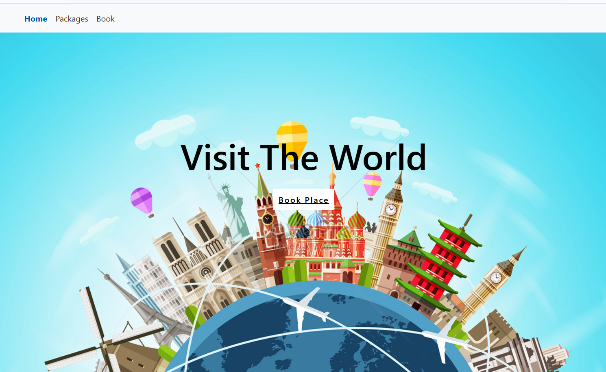
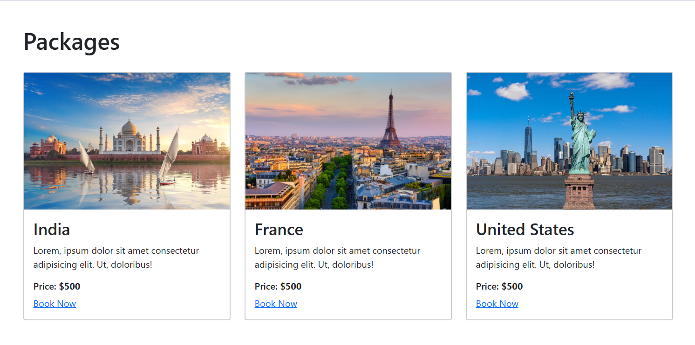

# Travel-website

This is a travel website where users can explore different destinations and get information about them. It is a responsive and visually appealing site that uses images and interactive content to showcase popular travel destinations.

<h2>Features</h2>
<ul>
  <li>A clean and simple homepage with attractive destination images.</li>
  <li>Information about popular countries like France, India, and the US.</li>
  <li>Responsive design that adjusts to different screen sizes.</li>
</ul>

<h2>Home page</h2>

<h2>Packages</h2>

<h2>Book Now</h2>
